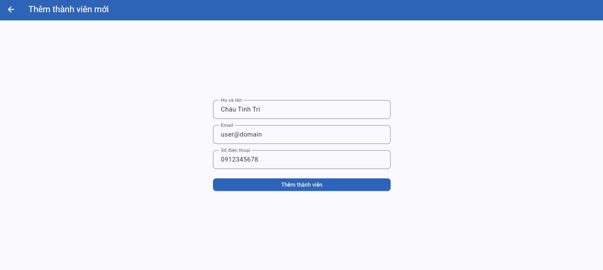
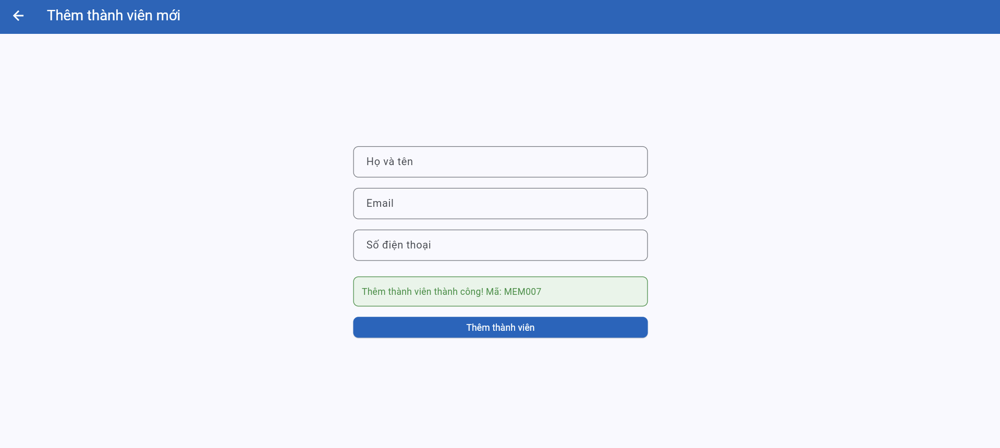

# Bug Reports — Báo cáo lỗi

> **Hướng dẫn**: Tạo 1 mục bug cho mỗi TC có kết quả **Fail**.
> Xem [examples/sample-bug-report.md](../examples/sample-bug-report.md) để hiểu cách viết bug report tốt.
> Mỗi bug cần: tiêu đề mô tả hành vi lỗi, bước tái hiện, expected vs actual, severity + giải thích.

| Thông tin | |
|---|---|
| **Nhóm** | GROUP 24 |
| **Ngày báo cáo** | 06/06/2026 |

---

## BUG-01

| Thuộc tính | Chi tiết |
|-----------|---------|
| **Mã lỗi** | BUG-01 |
| **TC liên quan** | TC-11 |
| **REQ liên quan** | REQ-04 |
| **Mức độ** | Medium |
| **Người phát hiện** | Đoàn Quốc Việt |
| **Ngày phát hiện** | 27/05/2026 |
| **Trạng thái** | Open |

**Tiêu đề:**
System displays "Expired" error message instead of "Suspended" message when a suspended member attempts to borrow a book.

**Môi trường:**
- Trình duyệt: Firefox 150.0.3
- Hệ điều hành: Linux
- Ngôn ngữ giao diện: Tiếng Việt/English

**Điều kiện tiên quyết:**
The suspended user is at the Books tab and the data is refreshed.

**Bước tái hiện:**
1. Log into the library application using a suspended member account (e.g., Account: cu.le@email.com / Member ID: MEM004). 
2. Navigate to the Books tab. 
3. Select any available book (e.g., BOOK001 - Lập trình Flutter cơ bản) and click the "Borrow" button. 
4. Confirm the transaction in the confirmation pop-up window.

**Kết quả mong đợi:**
The system denies the borrowing request and displays the exact error message indicating account suspension: "The member's account is currently suspended."

**Kết quả thực tế:**
The system successfully blocks the transaction but displays an incorrect red error banner at the bottom of the screen stating: "Thành viên đã hết hạn. Không thể mượn sách." (Member has expired. Cannot borrow book.)

**Tác động:**
Directly violates the explicit business rule in REQ-04 (suspended ≠ expired). This misleads both the library staff and the member regarding the true operational status of the account, causing confusion on how to resolve the restriction (e.g., attempting subscription renewal instead of lifting a penalty).

**Minh chứng:**

**Đề xuất xử lý:**
Update the backend verification logic or localization mapping for business rule constraints. Ensure that when checking member status, an account matching the Suspended flag triggers its dedicated warning string block instead of routing to the Expired message block.

---

## BUG-02

| Thuộc tính | Chi tiết |
|-----------|---------|
| **Mã lỗi** | BUG-02 |
| **TC liên quan** | TC-13 |
| **REQ liên quan** | REQ-04 |
| **Mức độ** | High |
| **Người phát hiện** | Đoàn Quốc Việt |
| **Ngày phát hiện** | 27/05/2026 |
| **Trạng thái** | Open |

**Tiêu đề:**
System fails to enforce maximum limit, allowing a member holding 3 active books to borrow a 4th book successfully.

**Môi trường:**
- Trình duyệt: Firefox 150.0.3
- Hệ điều hành: Linux
- Ngôn ngữ giao diện: Tiếng Việt/English

**Điều kiện tiên quyết:**
- The database contains a member account configured to have exactly 3 active, unreturned borrow records (e.g., Status: "Borrowed"), thereby hitting the maximum allowed limit. 
- The user is at the Books tab.

**Bước tái hiện:**
1. Log into the library application using the member account that already holds 3 books. 
2. Navigate to the Books tab. 
3. Select any available book (e.g., status: "Available") and click the "Borrow" button. 
4. Confirm the transaction in the confirmation pop-up.

**Kết quả mong đợi:**
The system denies the borrowing request because the member has already reached the maximum limit of 3 borrowed books, and displays an error message stating: "Member has reached the maximum limit of 3 books."

**Kết quả thực tế:**
The system allows the borrowing transaction to proceed completely, updates the book's availability status, and displays a green success banner stating: "Mượn sách thành công!" (Borrow book successfully!).

**Tác động:**
Critical business rule violation. This off-by-one or missing conditional logic bypasses library inventory controls entirely, allowing users to borrow books beyond specified limits and draining available book resources for other members.

**Minh chứng:**
 
 

**Đề xuất xử lý:**
Review the backend constraint validation inside the borrow processing controller. Ensure that a count query checking active loans handles strict inequality checks before saving the transaction to the database (e.g., verify that an if (activeLoans >= 3) rejection block handles the validation intercept properly prior to saving a new entry).

---

## BUG-03

| Attribute | Detail |
|-----------|---------|
| **Bug ID** | BUG-03 |
| **Related TC** | TC-23 |
| **Related REQ** | REQ-03 |
| **Severity** | Medium |
| **Reported by** | Đoàn Quốc Việt |
| **Date Found** | DD/MM/YYYY |
| **Status** | Open |

**Title:**  
Category filter is case-sensitive and returns no results for lowercase category input

**Environment:**
- Browser: Google Chrome
- Operating System: Windows
- UI Language: Vietnamese

**Preconditions:**  
The data has been reset. The user has logged in successfully.

**Steps to Reproduce:**
1. Open the **Books** tab.
2. Enter `công nghệ` in the category filter field.
3. Observe the result list.

**Expected Result:**  
The system should display books in the `Công nghệ` category, such as BOOK001, BOOK002, BOOK003, BOOK005, and BOOK008.

**Actual Result:**  
The system displays `Không tìm thấy sách nào.`

**Impact:**  
Users may fail to find books even when they enter a valid category name, only because the input uses lowercase characters. This reduces the usability and reliability of the search/filter function.

**Evidence:**  

**Suggested Fix:**  
Normalize both the category input and stored category values before comparison, for example by converting both values to lowercase before filtering.

---

## BUG-04

| Attribute | Detail |
|-----------|---------|
| **Bug ID** | BUG-04 |
| **Related TC** | TC-25 |
| **Related REQ** | REQ-05 |
| **Severity** | Medium |
| **Reported by** | Đoàn Quốc Việt |
| **Date Found** | DD/MM/YYYY |
| **Status** | Open |

**Title:**  
The system does not display an overdue warning when an overdue book is returned

**Environment:**
- Browser: Google Chrome
- Operating System: Windows
- UI Language: Vietnamese

**Preconditions:**  
The data has been reset. The user has logged in with member account `ba.nguyen@email.com`. BR001 exists in the initial data and has due date 15/09/2024.

**Steps to Reproduce:**
1. Log in with `ba.nguyen@email.com`.
2. Open the **Borrow / Return** tab.
3. Find BR001 for BOOK003.
4. Click **Return Book**.
5. Observe the system message.

**Expected Result:**  
The system allows the book to be returned and displays an overdue warning because BR001 is overdue.

**Actual Result:**  
The system displays only `Trả sách thành công.` and does not display any overdue warning.

**Impact:**  
Users are not informed that the book was returned late, which violates the overdue return rule in REQ-05.

**Evidence:**  
  
  

**Suggested Fix:**  
Add overdue checking logic during the return action. If the borrow record due date is earlier than or equal to the current date, the system should display an overdue warning.

---

## BUG-05

| Attribute | Detail |
|-----------|---------|
| **Bug ID** | BUG-05 |
| **Related TC** | TC-26, TC-38 |
| **Related REQ** | REQ-05, REQ-08 |
| **Severity** | High |
| **Reported by** | Đoàn Quốc Việt |
| **Date Found** | DD/MM/YYYY |
| **Status** | Open |

**Title:**  
A member can view and return another member’s borrowed book

**Environment:**
- Browser: Google Chrome
- Operating System: Windows
- UI Language: Vietnamese

**Preconditions:**  
The data has been reset. The user has logged in with member account `ba.nguyen@email.com`.

**Steps to Reproduce:**
1. Log in with `ba.nguyen@email.com`.
2. Open the **Borrow / Return** tab.
3. Open the borrow record lookup area.
4. Search for `MEM006`.
5. Observe the returned result.
6. Click **Return Book** on BR003.

**Expected Result:**  
MEM002 must not be able to view or return BR003 because BR003 belongs to MEM006.

**Actual Result:**  
The system displays BR003 of MEM006 to MEM002. In TC-38, MEM002 can view the record through borrow record lookup. In TC-26, MEM002 can also return that record successfully.

**Impact:**  
This is a serious access control issue. A member can access and modify borrow records that do not belong to them.

**Evidence:**  
  

**Suggested Fix:**  
Restrict borrow record lookup and return actions for member accounts. A member should only be able to view and return their own borrow records.

---

## BUG-06

| Attribute | Detail |
|-----------|---------|
| **Bug ID** | BUG-06 |
| **Related TC** | TC-32 |
| **Related REQ** | REQ-07 |
| **Severity** | Medium |
| **Reported by** | Đoàn Quốc Việt |
| **Date Found** | DD/MM/YYYY |
| **Status** | Open |

**Title:**  
The system rejects a valid email address when adding a new member

**Environment:**
- Browser: Google Chrome
- Operating System: Windows
- UI Language: Vietnamese

**Preconditions:**  
The data has been reset. The user has logged in with the librarian account.

**Steps to Reproduce:**
1. Log in with `librarian@library.com`.
2. Open the **Members** tab.
3. Select **Add Member**.
4. Enter a full name.
5. Enter email `user@domain.com`.
6. Enter a phone number.
7. Click **Add Member**.

**Expected Result:**  
The system creates the new member successfully because `user@domain.com` contains `@` and a dot `.` in the domain part.

**Actual Result:**  
The system displays `Email không hợp lệ.` and does not create the new member.

**Impact:**  
The librarian cannot add a member even with a valid email format, which blocks the member management function.

**Evidence:**  

**Suggested Fix:**  
Review the email validation logic and ensure that emails in the format `user@domain.com` are accepted.

---

## BUG-07

| Attribute | Detail |
|-----------|---------|
| **Bug ID** | BUG-07 |
| **Related TC** | TC-34 |
| **Related REQ** | REQ-07 |
| **Severity** | Medium |
| **Reported by** | Đoàn Quốc Việt |
| **Date Found** | DD/MM/YYYY |
| **Status** | Open |

**Title:**  
The system allows adding a member with invalid email `user@domain`

**Environment:**
- Browser: Google Chrome
- Operating System: Windows
- UI Language: Vietnamese

**Preconditions:**  
The data has been reset. The user has logged in with the librarian account.

**Steps to Reproduce:**
1. Log in with `librarian@library.com`.
2. Open the **Members** tab.
3. Select **Add Member**.
4. Enter a full name.
5. Enter email `user@domain`.
6. Enter a phone number.
7. Click **Add Member**.

**Expected Result:**  
The system does not create the new member and displays an invalid email error because `user@domain` does not contain a dot `.` in the domain part.

**Actual Result:**  
The system creates a new member successfully and displays `Thêm thành viên thành công! Mã: MEM007`.

**Impact:**  
The system accepts invalid email data, which violates the email validation rule in REQ-07 and reduces member data quality.

**Evidence:**  
  

**Suggested Fix:**  
Update the email validation logic so that the domain part must contain a dot `.`.

---

## BUG-08

| Attribute | Detail |
|-----------|---------|
| **Bug ID** | BUG-08 |
| **Related TC** | TC-35 |
| **Related REQ** | REQ-07 |
| **Severity** | Medium |
| **Reported by** | Đoàn Quốc Việt |
| **Date Found** | DD/MM/YYYY |
| **Status** | Open |

**Title:**  
The system displays the wrong error message when adding a member with an existing email

**Environment:**
- Browser: Google Chrome
- Operating System: Windows
- UI Language: Vietnamese

**Preconditions:**  
The data has been reset. The user has logged in with the librarian account. Email `ba.nguyen@email.com` already exists in the initial seed data.

**Steps to Reproduce:**
1. Log in with `librarian@library.com`.
2. Open the **Members** tab.
3. Select **Add Member**.
4. Enter a full name.
5. Enter existing email `ba.nguyen@email.com`.
6. Enter a phone number.
7. Click **Add Member**.

**Expected Result:**  
The system does not create the new member and displays an error message indicating that the email already exists or is duplicated.

**Actual Result:**  
The system displays `Email không hợp lệ.` instead of an email duplication error.

**Impact:**  
The error message is misleading. The librarian may think the email format is invalid, while the real issue is duplicate email.

**Evidence:**  
  

**Suggested Fix:**  
Validate the email format first, then check whether the email already exists. If the email is duplicated, display a duplicate email error instead of an invalid email error.

<!-- Copy template BUG trên để thêm BUG-03, BUG-04, ... cho mỗi TC Fail -->
