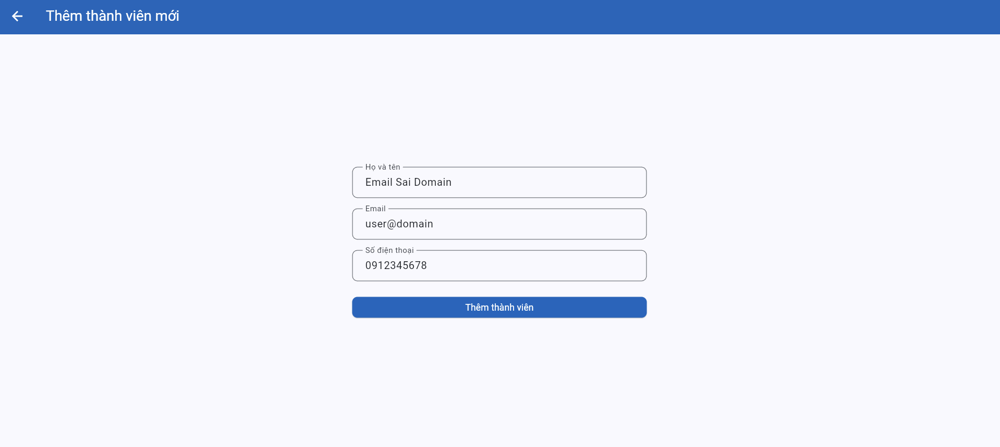
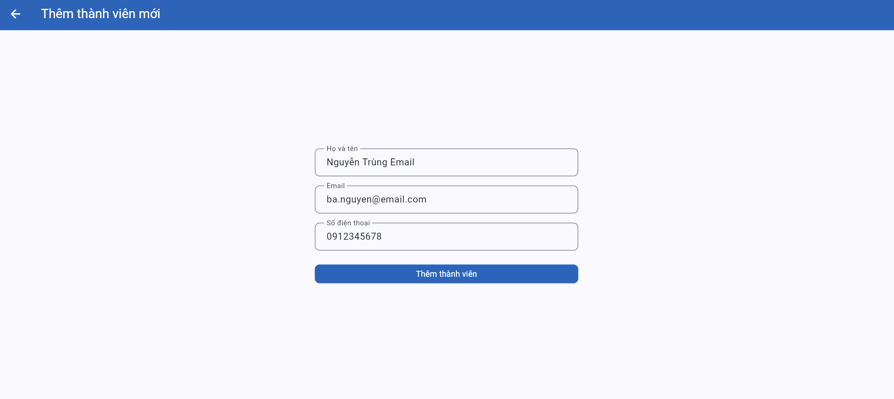
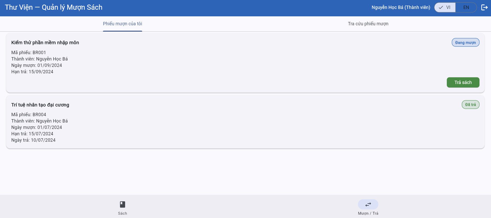
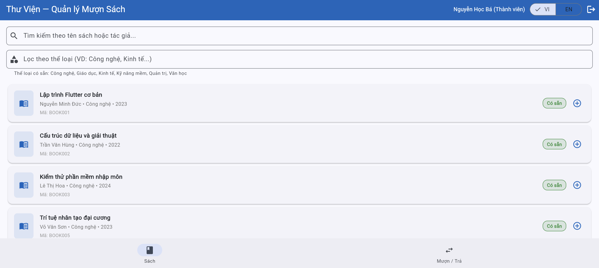
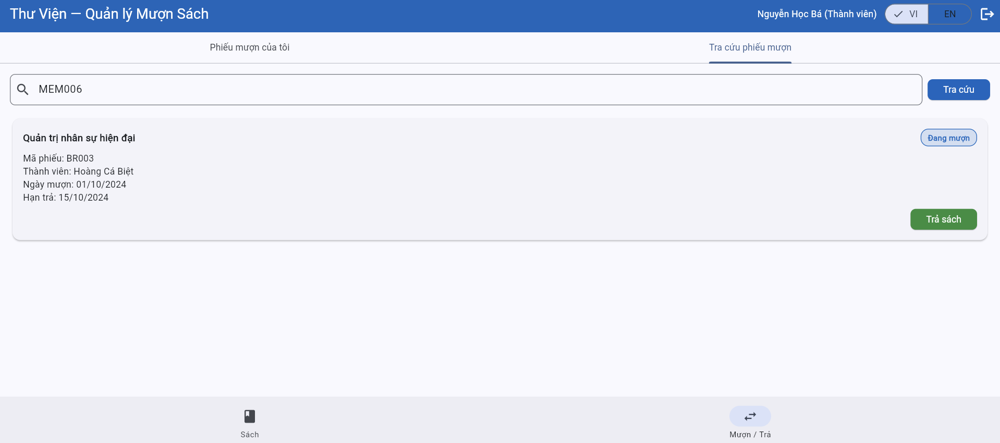
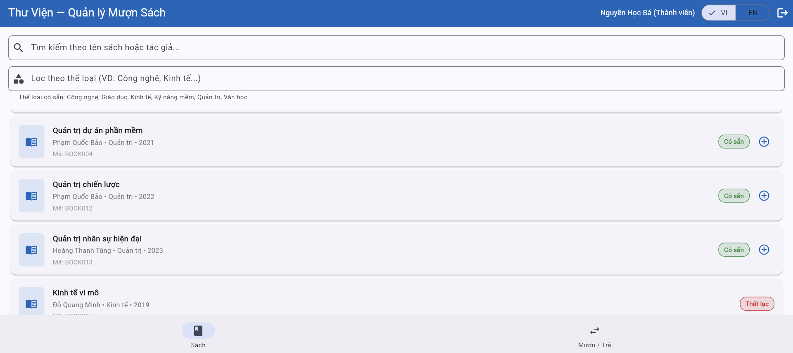

# Bug Reports — Báo cáo lỗi

> **Hướng dẫn**: Tạo 1 mục bug cho mỗi TC có kết quả **Fail**.
> Xem [examples/sample-bug-report.md](../examples/sample-bug-report.md) để hiểu cách viết bug report tốt.
> Mỗi bug cần: tiêu đề mô tả hành vi lỗi, bước tái hiện, expected vs actual, severity + giải thích.

| Thông tin | |
|---|---|

| **Nhóm** | Group 24 |
| **Ngày báo cáo** | 19/05/2006 |
=======
| **Nhóm** | GROUP 24 |
| **Ngày báo cáo** | 06/06/2026 |
>>>>>>> 8e75a8d270119b24ef3de43f14e0db26c1329366

**Môi trường:**
- Trình duyệt: Firefox 150.0.3
- Hệ điều hành: Linux
- Ngôn ngữ giao diện: Tiếng Việt/English
---

## BUG-03
=======
## BUG-01: System displays "Expired" error message instead of "Suspended" message when a suspended member attempts to borrow a book.
>>>>>>> 8e75a8d270119b24ef3de43f14e0db26c1329366

| Attribute | Detail |
|-----------|---------|

| **Bug ID** | BUG-03 |
| **Related TC** | TC-37 |
| **Related REQ** | REQ-07 |
| **Severity** | Medium |
| **Reported by** | Your Name |
| **Date Found** | DD/MM/YYYY |
| **Status** | Open |

**Title:**  
The system rejects a valid email when adding a new member

**Environment:**
- Browser: Google Chrome
- Operating System: Windows
- UI Language: Vietnamese

**Preconditions:**  
The data has been reset. The user has logged in with the librarian account.

**Steps to Reproduce:**
1. Log in with `librarian@library.com`.
2. Open the **Members** tab.
3. Select **Add Member**.
4. Enter full name `Nguyễn Văn Mới`.
5. Enter email `nguyen.van.moi@example.com`.
6. Enter phone number `0912345678`.
7. Click **Add Member**.

**Expected Result:**  
The system creates the new member successfully because `nguyen.van.moi@example.com` is a valid email address containing `@` and a dot `.` in the domain part.

**Actual Result:**  
The system displays **“Email không hợp lệ.”** and does not create the new member.

**Impact:**  
The librarian cannot add a new member even when the entered email is valid. This directly affects the member management function.

**Evidence:**  

**Suggested Fix:**  
Review the email validation logic. The system should accept valid email formats such as `user@domain.com`, including emails with dots in the local part such as `nguyen.van.moi@example.com`.

---

## BUG-04
=======
| **Mã lỗi** | BUG-01 |
| **TC liên quan** | TC-11 |
| **REQ liên quan** | REQ-04 |
| **Mức độ** | Medium |
| **Người phát hiện** | Đoàn Quốc Việt |
| **Ngày phát hiện** | 27/05/2026 |
| **Trạng thái** | Open |

**Điều kiện tiên quyết:**
The suspended user is at the Books tab and the data is refreshed.

**Bước tái hiện:**
1. Log into the library application using a suspended member account (e.g., Account: cu.le@email.com / Member ID: MEM004). 
2. Navigate to the Books tab. 
3. Select any available book (e.g., BOOK001 - Lập trình Flutter cơ bản) and click the "Borrow" button. 
4. Confirm the transaction in the confirmation pop-up window.

**Kết quả mong đợi:**
The system denies the borrowing request and displays the exact error message indicating account suspension: "The member's account is currently suspended."

**Kết quả thực tế:**
The system successfully blocks the transaction but displays an incorrect red error banner at the bottom of the screen stating: "Thành viên đã hết hạn. Không thể mượn sách." (Member has expired. Cannot borrow book.)

**Tác động:**
Directly violates the explicit business rule in REQ-04 (suspended ≠ expired). This misleads both the library staff and the member regarding the true operational status of the account, causing confusion on how to resolve the restriction (e.g., attempting subscription renewal instead of lifting a penalty).

**Minh chứng:**

**Đề xuất xử lý:**
Update the backend verification logic or localization mapping for business rule constraints. Ensure that when checking member status, an account matching the Suspended flag triggers its dedicated warning string block instead of routing to the Expired message block.

---

## BUG-02: System fails to enforce maximum limit, allowing a member holding 3 active books to borrow a 4th book successfully.
>>>>>>> 8e75a8d270119b24ef3de43f14e0db26c1329366

| Attribute | Detail |
|-----------|---------|
<<<<<<< HEAD
| **Bug ID** | BUG-04 |
| **Related TC** | TC-39 |
| **Related REQ** | REQ-07 |
| **Severity** | Medium |
| **Reported by** | Your Name |
| **Date Found** | DD/MM/YYYY |
| **Status** | Open |

**Title:**  
The system allows adding a member with invalid email `user@domain`

**Environment:**
- Browser: Google Chrome
- Operating System: Windows
- UI Language: Vietnamese

**Preconditions:**  
The data has been reset. The user has logged in with the librarian account.

**Steps to Reproduce:**
1. Log in with `librarian@library.com`.
2. Open the **Members** tab.
3. Select **Add Member**.
4. Enter full name `Email Sai Domain`.
5. Enter email `user@domain`.
6. Enter phone number `0912345678`.
7. Click **Add Member**.

**Expected Result:**  
The system does not create a new member and displays an invalid email error because `user@domain` does not contain a dot `.` in the domain part.

**Actual Result:**  
The system creates the new member and displays **“Thêm thành viên thành công! Mã: MEM007”**.

**Impact:**  
The system allows invalid email formats to be saved, reducing member data quality and violating the email validation rule in REQ-07.

**Evidence:**  
  

**Suggested Fix:**  
Update the email validation logic so that an email must contain `@` and a dot `.` in the domain part.
=======
| **Mã lỗi** | BUG-02 |
| **TC liên quan** | TC-13 |
| **REQ liên quan** | REQ-04 |
| **Mức độ** | High |
| **Người phát hiện** | Đoàn Quốc Việt |
| **Ngày phát hiện** | 27/05/2026 |
| **Trạng thái** | Open |

**Điều kiện tiên quyết:**
- The database contains a member account configured to have exactly 3 active, unreturned borrow records (e.g., Status: "Borrowed"), thereby hitting the maximum allowed limit. 
- The user is at the Books tab.

**Bước tái hiện:**
1. Log into the library application using the member account that already holds 3 books. 
2. Navigate to the Books tab. 
3. Select any available book (e.g., status: "Available") and click the "Borrow" button. 
4. Confirm the transaction in the confirmation pop-up.

**Kết quả mong đợi:**
The system denies the borrowing request because the member has already reached the maximum limit of 3 borrowed books, and displays an error message stating: "Member has reached the maximum limit of 3 books."

**Kết quả thực tế:**
The system allows the borrowing transaction to proceed completely, updates the book's availability status, and displays a green success banner stating: "Mượn sách thành công!" (Borrow book successfully!).

**Tác động:**
Critical business rule violation. This off-by-one or missing conditional logic bypasses library inventory controls entirely, allowing users to borrow books beyond specified limits and draining available book resources for other members.

**Minh chứng:**
 
 

**Đề xuất xử lý:**
Review the backend constraint validation inside the borrow processing controller. Ensure that a count query checking active loans handles strict inequality checks before saving the transaction to the database (e.g., verify that an if (activeLoans >= 3) rejection block handles the validation intercept properly prior to saving a new entry).
>>>>>>> 8e75a8d270119b24ef3de43f14e0db26c1329366

---

## BUG-05

| Attribute | Detail |
|-----------|---------|
| **Bug ID** | BUG-05 |
| **Related TC** | TC-40 |
| **Related REQ** | REQ-07 |
| **Severity** | Medium |
| **Reported by** | Your Name |
| **Date Found** | DD/MM/YYYY |
| **Status** | Open |

**Title:**  
The system displays the wrong error message when adding a member with an existing email

**Environment:**
- Browser: Google Chrome
- Operating System: Windows
- UI Language: Vietnamese

**Preconditions:**  
The data has been reset. The user has logged in with the librarian account. Email `ba.nguyen@email.com` already exists in the system.

**Steps to Reproduce:**
1. Log in with `librarian@library.com`.
2. Open the **Members** tab.
3. Select **Add Member**.
4. Enter full name `Nguyễn Trùng Email`.
5. Enter email `ba.nguyen@email.com`.
6. Enter phone number `0912345678`.
7. Click **Add Member**.

**Expected Result:**  
The system does not create a new member and displays an error message indicating that the email already exists or is duplicated.

**Actual Result:**  
The system displays **“Email không hợp lệ.”** instead of an email duplication error.

**Impact:**  
The incorrect error message misleads the librarian. The user may think the email format is invalid, while the actual issue is email duplication.

**Evidence:**  
  

**Suggested Fix:**  
Review the validation order. The system should first recognize the email as valid, then check whether the email already exists and display the correct duplication message.

---

## BUG-06

| Attribute | Detail |
|-----------|---------|
| **Bug ID** | BUG-06 |
| **Related TC** | TC-33 |
| **Related REQ** | REQ-05 |
| **Severity** | Medium |
| **Reported by** | Your Name |
| **Date Found** | DD/MM/YYYY |
| **Status** | Open |

**Title:**  
The system does not display an overdue warning when an overdue book is returned

**Environment:**
- Browser: Google Chrome
- Operating System: Windows
- UI Language: Vietnamese

**Preconditions:**  
The data has been reset. The user has logged in with member account `ba.nguyen@email.com`. Borrow record BR001 is in “Đang mượn” status and is overdue.

**Steps to Reproduce:**
1. Log in with `ba.nguyen@email.com`.
2. Open the **Borrow / Return** tab.
3. Find borrow record BR001 for **Kiểm thử phần mềm nhập môn**.
4. Click **Return Book**.
5. Observe the message and book status.

**Expected Result:**  
The system allows the book to be returned and displays an overdue warning.

**Actual Result:**  
The system allows the book to be returned, and BOOK003 changes back to “Có sẵn”, but no overdue warning is displayed.

**Impact:**  
The user is not informed that the book was returned late, which violates the return book requirement in REQ-05.

**Evidence:**  
  

**Suggested Fix:**  
Add or fix the warning logic when a user returns a book whose due date is less than or equal to the current date.

---

## BUG-07

| Attribute | Detail |
|-----------|---------|
| **Bug ID** | BUG-07 |
| **Related TC** | TC-34 |
| **Related REQ** | REQ-05, REQ-08 |
| **Severity** | High |
| **Reported by** | Your Name |
| **Date Found** | DD/MM/YYYY |
| **Status** | Open |

**Title:**  
A member can view and return a book borrowed by another member

**Environment:**
- Browser: Google Chrome
- Operating System: Windows
- UI Language: Vietnamese

**Preconditions:**  
The data has been reset. The user has logged in with member account `ba.nguyen@email.com`.

**Steps to Reproduce:**
1. Log in with `ba.nguyen@email.com`.
2. Open the **Borrow / Return** tab.
3. Open the **Borrow Record Lookup** section.
4. Enter `MEM006` and click **Search**.
5. Observe the returned result.
6. Click **Return Book** on borrow record BR003 if the system allows it.
7. Check the status of BOOK013 in the **Books** tab.

**Expected Result:**  
A member must not be able to view borrow records of another member and must not be able to return books belonging to another member’s borrow records.

**Actual Result:**  
Member MEM002 can view borrow record BR003 of MEM006, can see the **Return Book** button, and after the action BOOK013 is displayed as “Có sẵn”.

**Impact:**  
This is a serious access control issue. A member can access and modify borrow records that do not belong to them.

**Evidence:**  
  

**Suggested Fix:**  
Restrict borrow record lookup and return actions so that a member can only view and operate on their own borrow records.

---

