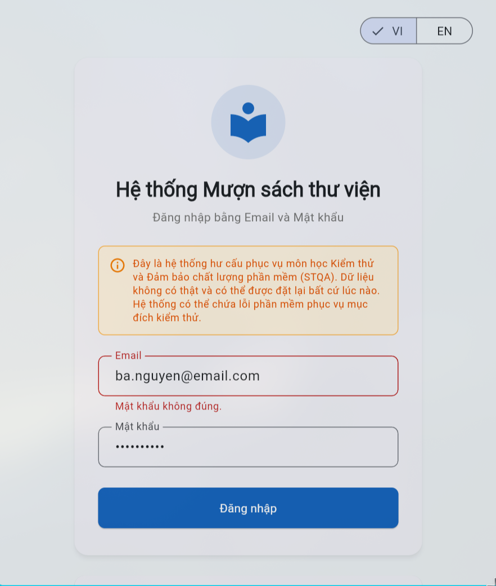
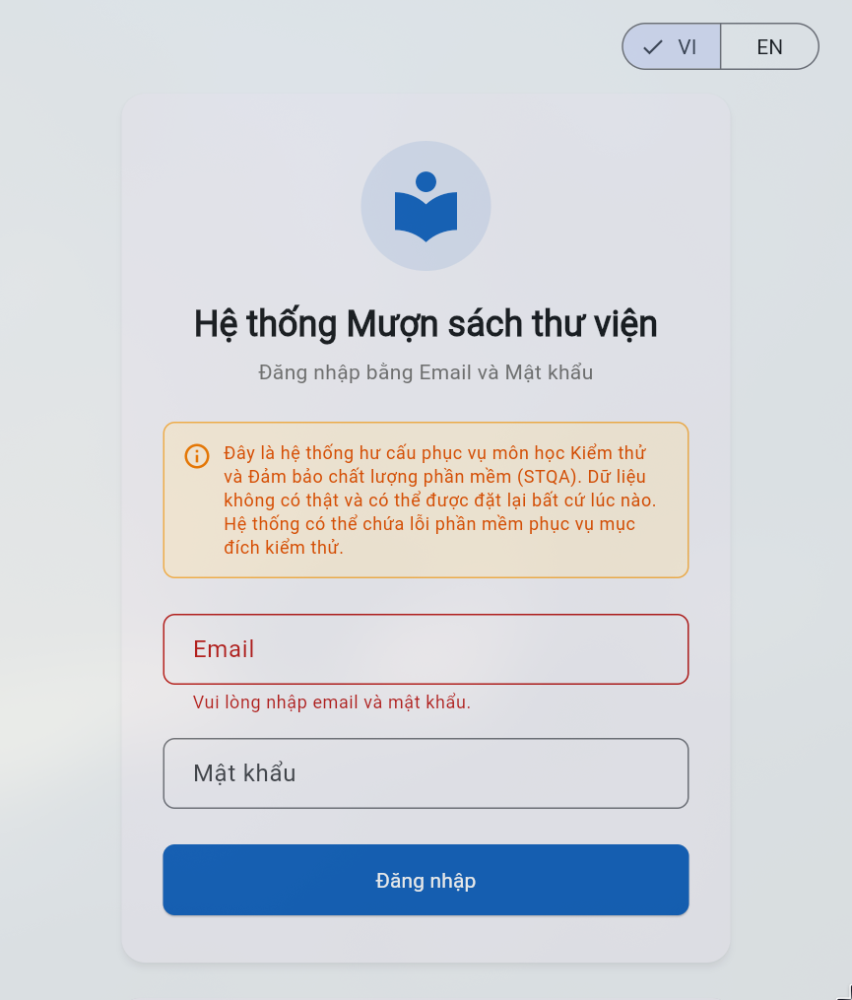
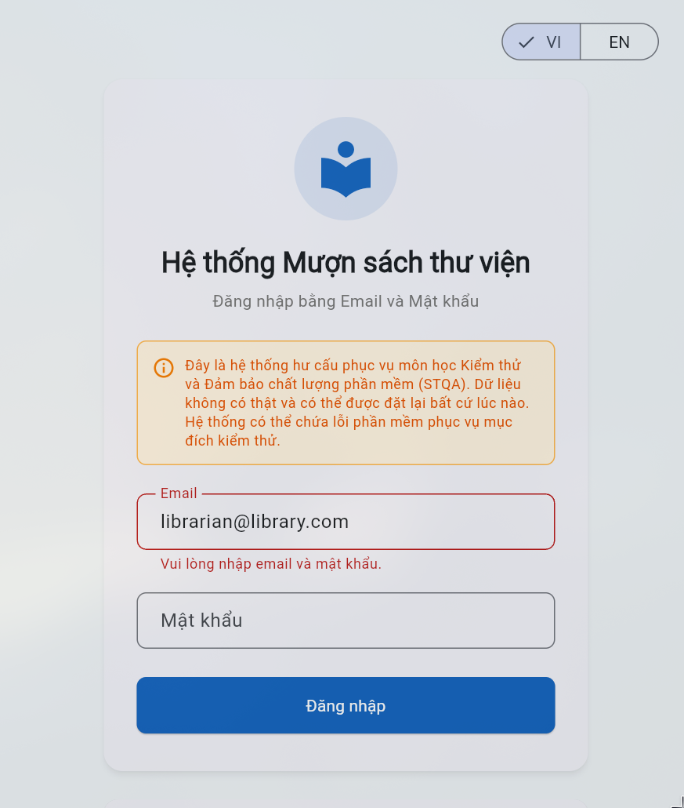
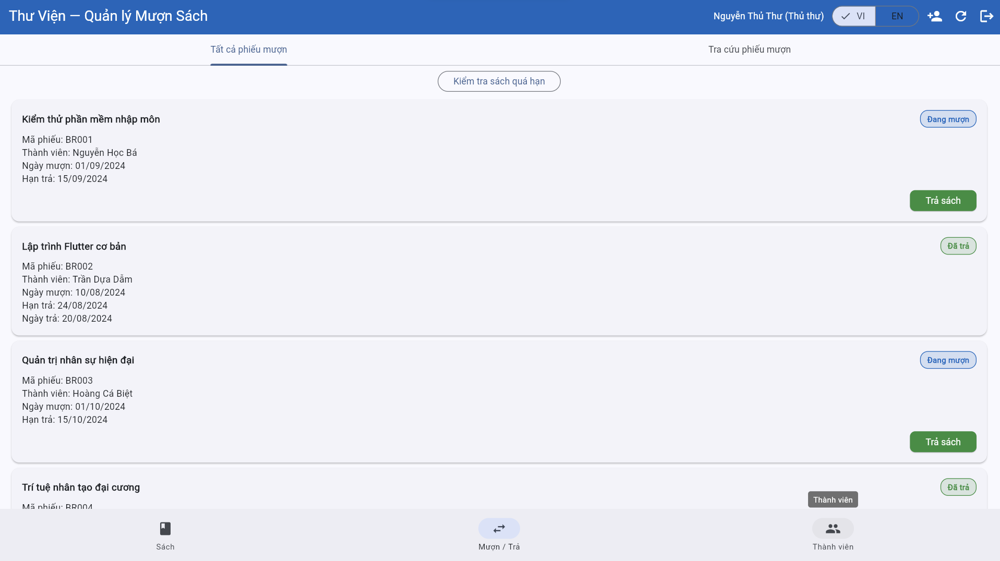
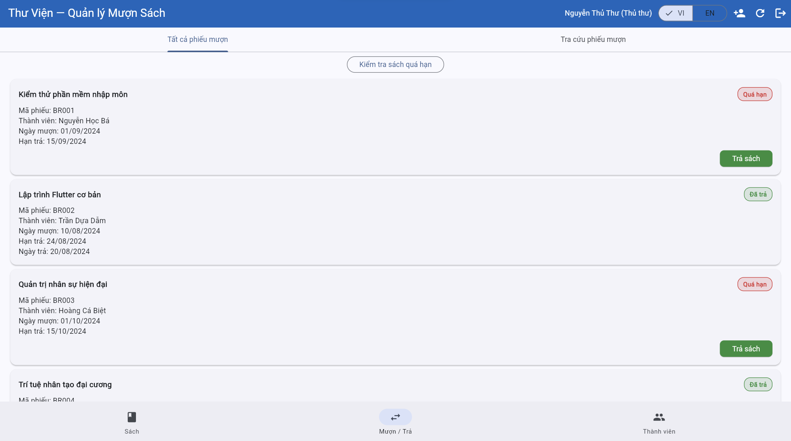
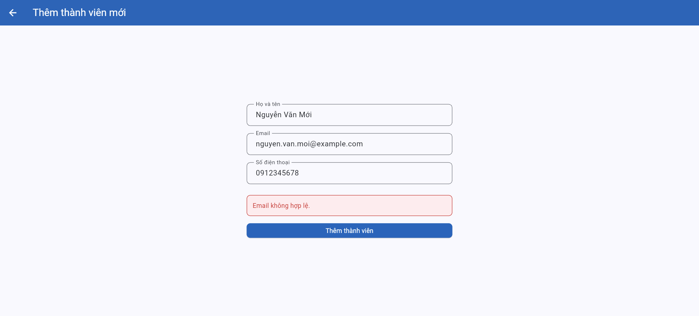
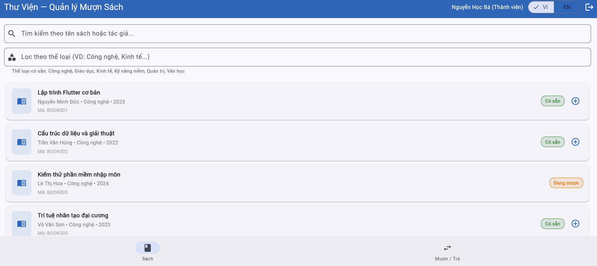
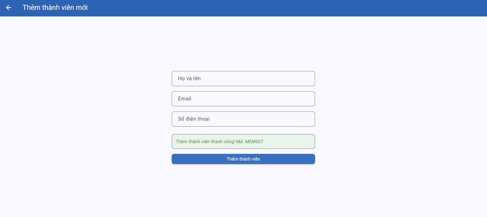
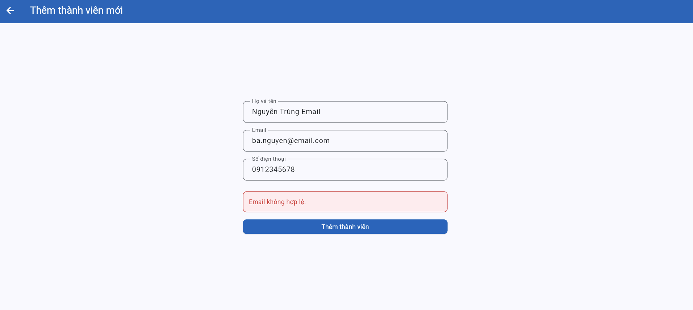

# Test Execution — Kết quả thực thi kiểm thử

> **Hướng dẫn**: Chạy từng TC trên hệ thống https://stqa.rbc.vn, ghi lại kết quả thực tế.
> Kết luận: **Pass** (kết quả đúng), **Fail** (kết quả sai → tạo bug report), **Blocked** (không thực hiện được vì lỗi khác chặn), **Not Run** (chưa chạy).

| Thông tin | |
|---|---|
| **Nhóm** | Group 24 |
| **Ngày thực thi** | 19/05/2026 |
| **Trình duyệt** | Google Chrome |
| **Hệ điều hành** | Windows 11 |

---

## Kết quả chi tiết

| Mã TC | Nhóm chức năng | Kết quả mong đợi (tóm tắt) | Kết quả thực tế | Kết luận | Minh chứng | Bug |
|-------|---------------|---------------------------|-----------------|---------|-----------|----| 
| TC-01 | Đăng nhập | Chuyển hướng đến trang chủ thành công | Thành công chuyển hướng đến trang chủ và hiện tên người dùng + vai trò | Pass |  | - |
| TC-02 | Đăng nhập | Hiển thị thông báo lỗi: "Không tìm thấy thành viên". | Hiện thông báo lỗi dưới phần nhập email: "Không tìm thấy thành viên" | Pass |  | - |
| TC-03 | Đăng nhập | Hiển thị thông báo lỗi: "Mật khẩu không đúng". | Hiện thông báo lỗi dưới phần nhập email: "Mật khẩu không đúng" | Pass | | - |
| TC-04 | Đăng nhập | Hiển thị thông báo lỗi: "Vui lòng nhập email và mật khẩu". | Hiện thông báo lỗi dưới phần nhập email: "Vui lòng nhập email và mật khẩu" | Pass |  | - |
| TC-05 | Đăng nhập | Hiển thị thông báo lỗi: "Vui lòng nhập email và mật khẩu". | Hiện thông báo lỗi dưới phần nhập email: "Vui lòng nhập email và mật khẩu" | Pass |  | - | 
| TC-06 | Đăng nhập | Hiển thị thông báo lỗi: "Vui lòng nhập email và mật khẩu". | Hiện thông báo lỗi dưới phần nhập email: "Vui lòng nhập email và mật khẩu" | Pass |  | - |
| TC-07 | Đăng nhập | Hiển thị thông báo lỗi: "Không tìm thấy thành viên". | Hiện thông báo lỗi dưới phần nhập email: "Không tìm thấy thành viên" | Pass |  | - |
| TC-35 | Xử lý quá hạn | Thủ thư nhấn được nút kiểm tra quá hạn và hệ thống cập nhật các phiếu quá hạn | Sau khi đăng nhập bằng tài khoản thủ thư và nhấn **Kiểm tra sách quá hạn**, hệ thống hiển thị thông báo “Đã cập nhật: 2 phiếu mượn quá hạn.” | Pass |  | - |
| TC-36 | Xử lý quá hạn | Phiếu có ngày hết hạn ≤ ngày hiện tại được đánh dấu “Quá hạn” | Trước khi kiểm tra, BR001 và BR003 đang ở trạng thái “Đang mượn”. Sau khi nhấn **Kiểm tra sách quá hạn**, BR001 và BR003 chuyển sang trạng thái “Quá hạn”. | Pass |   | - |
| TC-37 | Quản lý thành viên | Thủ thư thêm thành viên hợp lệ thành công | Nhập họ tên `Nguyễn Văn Mới`, email `nguyen.van.moi@example.com`, SĐT `0912345678`. Hệ thống hiển thị lỗi “Email không hợp lệ.” và không tạo thành viên mới. | Fail |  | BUG-03 |
| TC-38 | Quản lý thành viên | Thành viên thường không được thêm thành viên | Đăng nhập bằng tài khoản thành viên `ba.nguyen@email.com`. Giao diện chỉ hiển thị tab **Sách** và **Mượn / Trả**, không có tab **Thành viên** hoặc nút **Thêm thành viên**. | Pass |  | - |
| TC-39 | Quản lý thành viên | Email `user@domain` bị từ chối vì thiếu dấu `.` trong domain | Nhập email `user@domain`, hệ thống vẫn hiển thị “Thêm thành viên thành công! Mã: MEM007”. | Fail |  | BUG-04 |
| TC-40 | Quản lý thành viên | Email đã tồn tại `ba.nguyen@email.com` bị từ chối vì trùng email | Nhập email đã tồn tại `ba.nguyen@email.com`, hệ thống hiển thị “Email không hợp lệ.” thay vì thông báo email đã tồn tại. | Fail |  | BUG-05 |

---

## Tổng hợp kết quả

| Chỉ số | Giá trị |
|--------|---------|
| Tổng số test case | `<!-- số -->` |
| Pass | `<!-- số -->` |
| Fail | `<!-- số -->` |
| Blocked | `<!-- số -->` |
| Not Run | `<!-- số -->` |
| **Tỷ lệ Pass** | `<!-- xx% -->` |

### Kết quả theo nhóm chức năng

| Nhóm | Tổng TC | Pass | Fail | Tỷ lệ Pass |
|------|---------|------|------|------------|
| | | | | |
