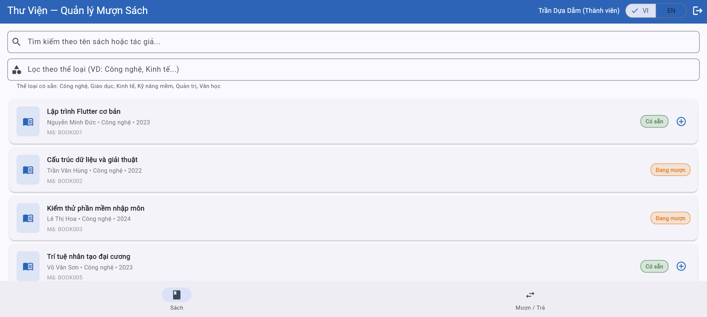
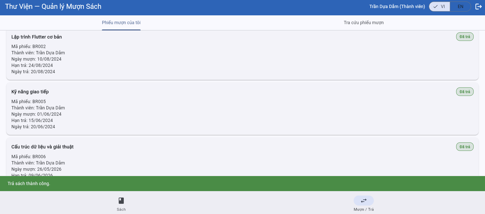

# Test Execution — Kết quả thực thi kiểm thử

> **Hướng dẫn**: Chạy từng TC trên hệ thống https://stqa.rbc.vn, ghi lại kết quả thực tế.
> Kết luận: **Pass** (kết quả đúng), **Fail** (kết quả sai → tạo bug report), **Blocked** (không thực hiện được vì lỗi khác chặn), **Not Run** (chưa chạy).

| Thông tin | |
|---|---|
| **Nhóm** | Group 24 |
| **Ngày thực thi** | 19/05/2026 |
| **Trình duyệt** | Google Chrome |
| **Hệ điều hành** | Windows 11 |

---

## Kết quả chi tiết

### REQ-01: Login

| Mã TC | Nhóm chức năng | Kết quả mong đợi (tóm tắt) | Kết quả thực tế | Kết luận | Minh chứng | Bug |
|-------|---------------|---------------------------|-----------------|---------|-----------|----| 
| TC-32 | Return Book | The borrowed book is returned successfully and the borrow record changes to “Đã trả” | BOOK002 was initially “Có sẵn”. After borrowing, BOOK002 changed to “Đang mượn”. After returning the book, the system displayed “Trả sách thành công.” and borrow record BR006 appeared with status “Đã trả”. | Pass |    | - |
| TC-33 | Return Book | The system displays an overdue warning when an overdue book is returned | Member MEM002 returned borrow record BR001 for BOOK003, whose due date was 15/09/2024. After returning the book, BOOK003 changed back to “Có sẵn”, but no overdue warning was displayed. | Fail |   | BUG-06 |
| TC-34 | Return Book / Access Control | A member must not be able to view or return another member’s borrowed book | Member MEM002 searched for `MEM006` and was able to view borrow record BR003 of another member. The record also displayed a **Return Book** button. After the action, BOOK013 was shown as “Có sẵn”, indicating that the member could return another member’s book. | Fail |   | BUG-07 |
| TC-35 | Overdue Handling | The librarian can click the overdue checking button and the system updates overdue records | After logging in with the librarian account and clicking **Kiểm tra sách quá hạn**, the system displayed the message “Đã cập nhật: 2 phiếu mượn quá hạn.” | Pass |  | - |
| TC-36 | Overdue Handling | Borrow records whose due date is less than or equal to the current date are marked as “Quá hạn” | Before overdue checking, BR001 and BR003 were in “Đang mượn” status. After clicking **Kiểm tra sách quá hạn**, BR001 and BR003 changed to “Quá hạn”. | Pass |   | - |
| TC-37 | Member Management | The librarian can add a new member with valid information | After entering full name `Nguyễn Văn Mới`, email `nguyen.van.moi@example.com`, and phone number `0912345678`, the system displayed “Email không hợp lệ.” and did not create the new member. | Fail |  | BUG-03 |
| TC-38 | Member Management | A normal member cannot add a new member | After logging in with member account `ba.nguyen@email.com`, the interface only displayed the **Books** and **Borrow / Return** tabs. The **Members** tab and **Add Member** button were not available. | Pass |  | - |
| TC-39 | Member Management | Email `user@domain` is rejected because it does not contain a dot in the domain part | After entering email `user@domain`, the system still displayed “Thêm thành viên thành công! Mã: MEM007”. | Fail |  | BUG-04 |
| TC-40 | Member Management | Existing email `ba.nguyen@email.com` is rejected because it is duplicated | After entering existing email `ba.nguyen@email.com`, the system displayed “Email không hợp lệ.” instead of an email duplication error. | Fail |  | BUG-05 |
=======
| TC-01 | Login | Redirected to the homepage successfully | Successfully redirected to the homepage and displayed username + role | Pass |  | - |
| TC-02 | Login | Displays error message: "Không tìm thấy thành viên". | Displayed error message under the email input field: "Không tìm thấy thành viên" | Pass |  | - |
| TC-03 | Login | Displays error message: "Mật khẩu không đúng". | Displayed error message under the email input field: "Mật khẩu không đúng" | Pass |  | - |
| TC-04 | Login | Displays error message: "Vui lòng nhập email và mật khẩu". | Displayed error message under the email input field: "Vui lòng nhập email và mật khẩu" | Pass |  | - |
| TC-05 | Login | Displays error message: "Vui lòng nhập email và mật khẩu". | Displayed error message under the email input field: "Vui lòng nhập email và mật khẩu" | Pass |  | - |
| TC-06 | Login | Displays error message: "Vui lòng nhập email và mật khẩu". | Displayed error message under the email input field: "Vui lòng nhập email và mật khẩu" | Pass |  | - |
| TC-07 | Login | Displays error message: "Không tìm thấy thành viên". | Displayed error message under the email input field: "Không tìm thấy thành viên" | Pass |  | - |
>>>>>>> 8e75a8d270119b24ef3de43f14e0db26c1329366

### REQ-04: Borrow Book

| Mã TC | Nhóm chức năng | Kết quả mong đợi (tóm tắt) | Kết quả thực tế | Kết luận | Minh chứng | Bug |
|-------|---------------|---------------------------|-----------------|---------|-----------|----| 
| TC-08 | Borrow Book | Successful book borrowing with correct status transition and 14-day loan period calculation.                         | \- The member borrow BOOK001 succesfully.  \- Book status transitions to "Borrowed".  \- A 14-day loan period was added on the day MEM006 started borrowing BOOK001.  \- A green banner at the bottom of the screen stating: "Mượn sách thành công!" | Pass       |     | \-     |
| TC-09 | Borrow Book | The system denies the borrowing request if the book is unavailable                                                   | The system displays a disabled button labeled 'Borrowed' next to book BOOK003, preventing the user from triggering a borrowing request.                                                                                                                                | Pass       |  | \-     |
| TC-10 | Borrow Book | The system denies the borrowing request if the book is lost                                                          | The system displays a disabled button labeled 'Lost' next to book BOOK007, preventing the user from triggering a borrowing request.                                                                                                                                    | Pass       |  | \-     |
| TC-11 | Borrow Book | The system denies the borrowing request if the member status is suspended                                            | The system displays a red error banner at the bottom of the screen stating: 'Thành viên đã hết hạn. Không thể mượn sách.' (Member has expired. Cannot borrow book.)                                                                                                    | Fail       |    | BUG-01 |
| TC-12 | Borrow Book | The system denies the borrowing request if the member status is expired                                              | The system displays a red error banner at the bottom of the screen stating: 'Thành viên đã hết hạn. Không thể mượn sách.' (Member has expired. Cannot borrow book.)                                                                                                    | Pass       |    | \-     |
| TC-13 | Borrow Book | The system denies the borrowing request because the member has already reached the maximum limit of 3 borrowed books | The system allows the borrowing transaction to proceed and displays a green banner stating: "Mượn sách thành công!".                                                                                                                                                   | Fail       |      | BUG-02 |
---

## Tổng hợp kết quả

| Chỉ số | Giá trị |
|--------|---------|
| Tổng số test case | `<!-- số -->` |
| Pass | `<!-- số -->` |
| Fail | `<!-- số -->` |
| Blocked | `<!-- số -->` |
| Not Run | `<!-- số -->` |
| **Tỷ lệ Pass** | `<!-- xx% -->` |

### Kết quả theo nhóm chức năng

| Nhóm | Tổng TC | Pass | Fail | Tỷ lệ Pass |
|------|---------|------|------|------------|
| | | | | |
